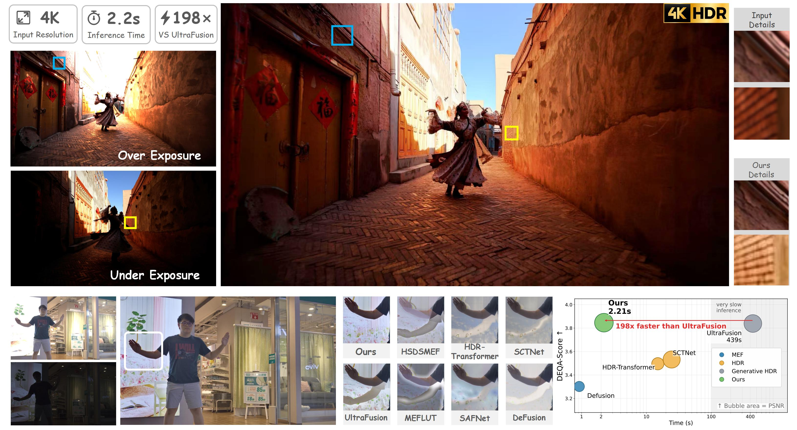

<h1 align="center">SwiftFusion: Towards Motion-Robust and Efficient 4K HDR Fusion</h1>


<div align="center">
  Yichen Bian, Zixuan Chen, Yujin Wang,* Xin Cai, Shi Guo, Junhao Zhuang, Leilei Gu, Tianfan Xue
</div>

<p align="center" width="100%">
    
</p>

# 🛠️ Environment Setup

## Installation

Clone the project and create a new conda environment:

```bash
git clone --recursive "URL"
conda create -n swiftfusion python=3.12 -y
conda activate swiftfusion
pip install -r requirements.txt
```

Install [DiffSynth](https://github.com/modelscope/DiffSynth-Studio)

```bash
git clone https://github.com/modelscope/DiffSynth-Studio.git  
cd DiffSynth-Studio
pip install -e .
```

Stage 4 and full inference require the CUDA implementation of
[Block-Sparse-Attention](https://github.com/mit-han-lab/Block-Sparse-Attention):

```bash
git clone https://github.com/mit-han-lab/Block-Sparse-Attention.git
cd Block-Sparse-Attention
pip install packaging ninja
python setup.py install
```
## Download Models

Download the Wan 2.1 T2V 1.3B checkpoints:

```bash
python download_models.py --output_dir ./models/Wan-AI/Wan2.1-T2V-1.3B
```

A RAFT Sintel checkpoint is also required by all four training stages and
full inference.

# 🚀Training

SwiftFusion is trained in four stages. Each stage has a standalone Python
entrypoint; `train_stages.sh` is an optional common launcher.

| Stage | Entrypoint | Initialization | Output |
|---|---|---|---|
| 1 | `train_stage1.py` | Wan 2.1 base model | Exposure-fusion DiT LoRA |
| 2 | `train_stage2.py` | Wan 2.1 VAE | HF-guided decoder checkpoint |
| 3 | `train_stage3.py` | Stage 1 LoRA + Stage 2 decoder | One-step distilled student LoRA |
| 4 | `train_stage4.py` | Stage 1 LoRA + Stage 3 LoRA + Stage 2 decoder | Sparse-attention LoRA |

The metadata file is a JSON list. Absolute
paths can be used directly. If the metadata uses relative paths, additionally
pass `--data_root /path/to/dataset` to Stages 1, 3, and 4. Stage 2 supports
the optional `--path_prefix_from` and `--path_prefix_to` arguments for
prefix rewriting.

```json
[
    {
        "gt": "path/to/gt",
        "prompt": "",
        "video": [
            "path/to/oe",
            "path/to/ue" 
        ]
    },
]
```

### Stage 1: Base DiT LoRA

```bash
python train_stage1.py \
  --metadata_path /path/to/train_metadata.json \
  --model_dir /path/to/Wan2.1-T2V-1.3B \
  --raft_checkpoint /path/to/raft-sintel.pth \
  --output_dir ./outputs/stage1
```

### Stage 2: HF-guided decoder

Stage 2 uses variable-resolution inputs with batch size 1. Inputs larger than
4K are proportionally downscaled; smaller inputs retain their native
resolution.

```bash
python train_stage2.py \
  --vae_checkpoint /path/to/Wan2.1-T2V-1.3B/Wan2.1_VAE.pth \
  --raft_checkpoint /path/to/raft-sintel.pth \
  --metadata_path /path/to/train_metadata.json \
  --output_dir ./outputs/stage2
```

### Stage 3: one-step distillation

```bash
python train_stage3.py \
  --metadata_path /path/to/train_metadata.json \
  --model_dir /path/to/Wan2.1-T2V-1.3B \
  --raft_checkpoint /path/to/raft-sintel.pth \
  --base_lora_checkpoint /path/to/stage1.safetensors \
  --decoder_checkpoint /path/to/stage2.pt \
  --output_dir ./outputs/stage3
```

### Stage 4: sparse-attention LoRA

```bash
python train_stage4.py \
  --metadata_path /path/to/train_metadata.json \
  --model_dir /path/to/Wan2.1-T2V-1.3B \
  --raft_checkpoint /path/to/raft-sintel.pth \
  --base_lora_checkpoint /path/to/stage1.safetensors \
  --distilled_lora_checkpoint /path/to/stage3.safetensors \
  --decoder_checkpoint /path/to/stage2.pt \
  --output_dir ./outputs/stage4
```

For distributed training of Stages 1, 3, or 4, replace `python` with
`accelerate launch`. Run any entrypoint with `--help` to inspect all
optimization, checkpointing, and data-loading options.

# ⚙️ Inference

`inference_full.py` loads the checkpoints produced by all four stages.
OE and UE must have the same resolution. The DiT operates at an internal
resolution of 720 x 1280 by default, while the final output always matches
the original OE/UE resolution.

```bash
CUDA_VISIBLE_DEVICES=0 python inference_full.py \
  --oe /path/to/oe.png \
  --ue /path/to/ue.png \
  --output ./outputs/result.png \
  --model_dir /path/to/Wan2.1-T2V-1.3B \
  --raft_checkpoint /path/to/raft-sintel.pth \
  --base_lora_checkpoint /path/to/stage1.safetensors \
  --distilled_lora_checkpoint /path/to/stage3.safetensors \
  --sparse_lora_checkpoint /path/to/stage4.safetensors \
  --decoder_checkpoint /path/to/stage2.pt \
  --vram_management
```

Besides the final image, inference saves the internal low-resolution decoder
result and copies of the OE/UE inputs next to the requested output path.
